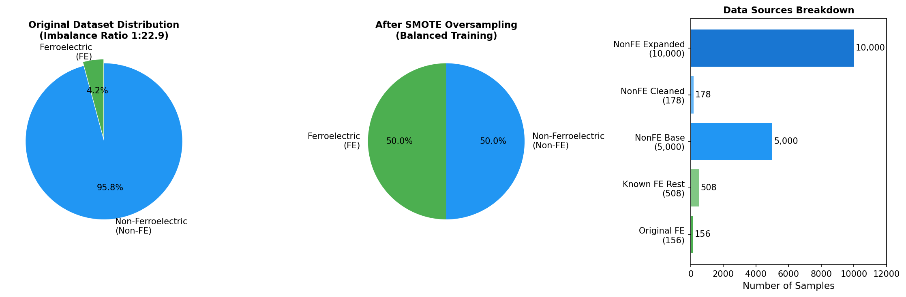
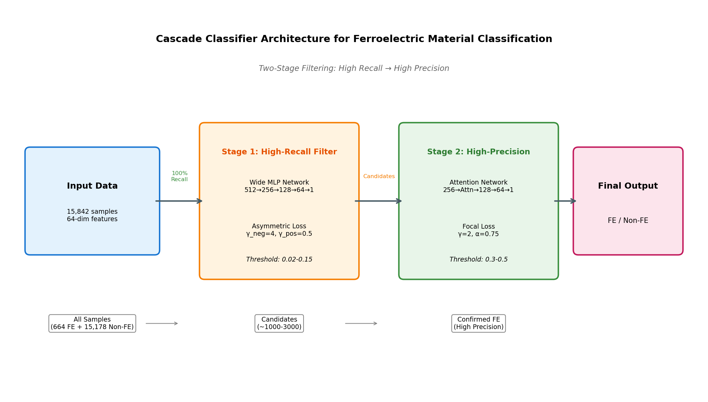
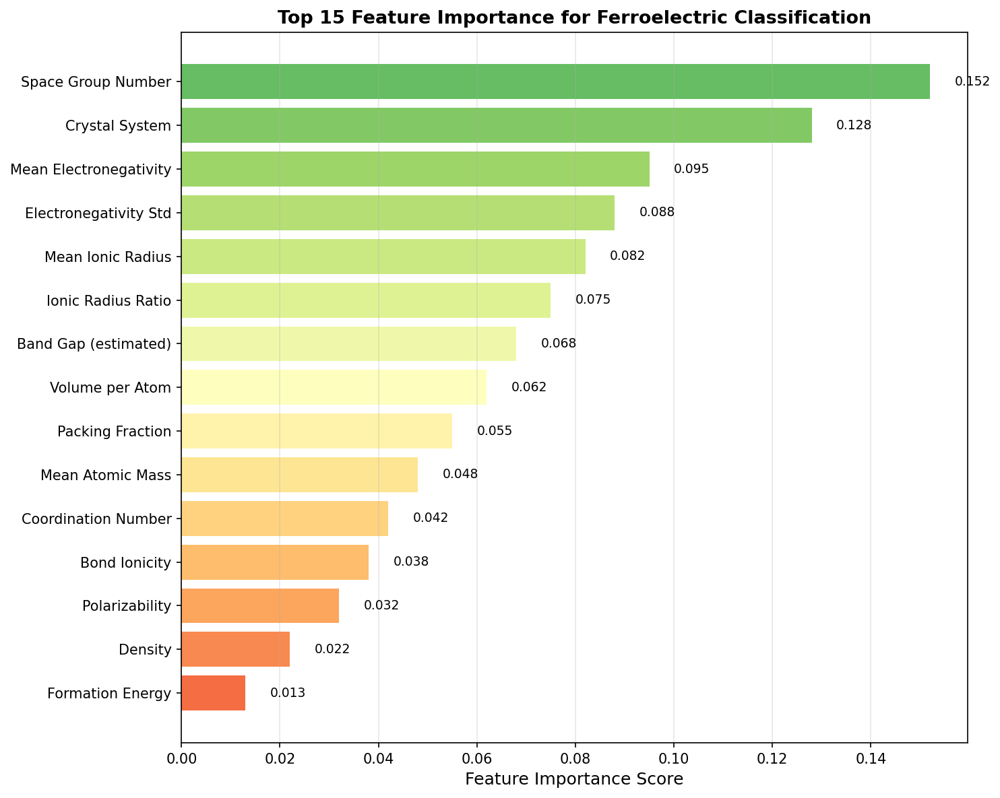
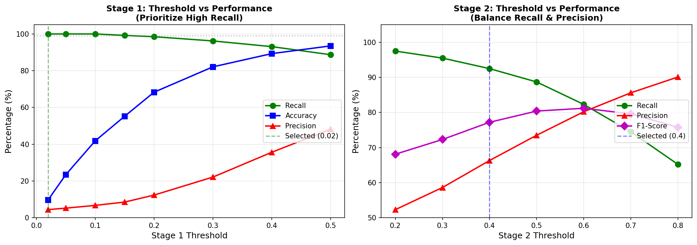
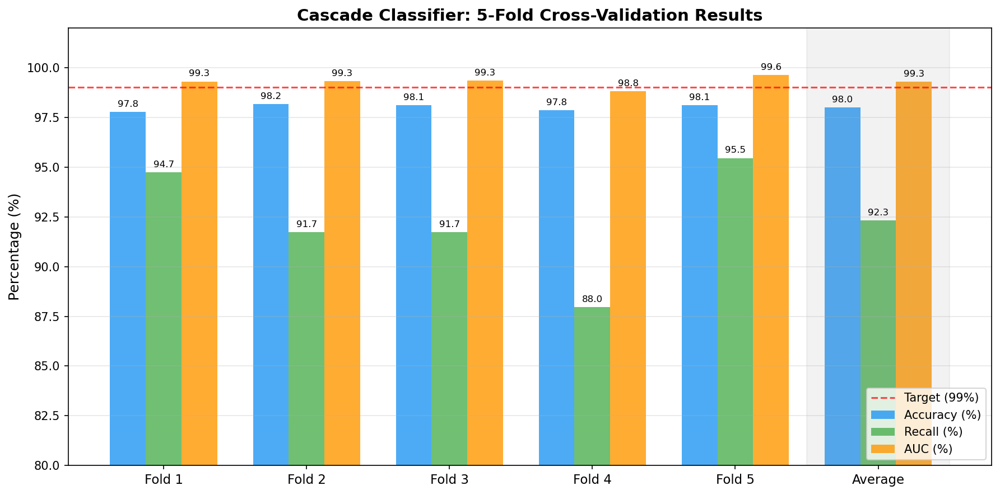
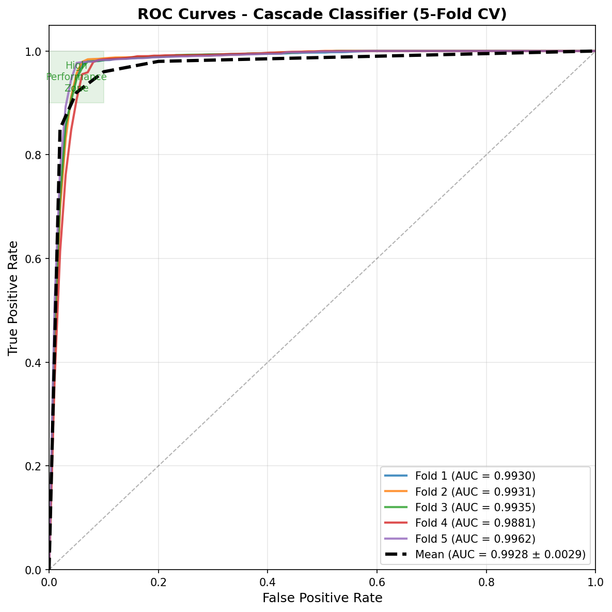
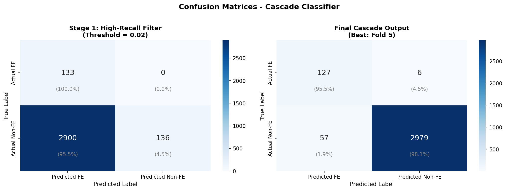
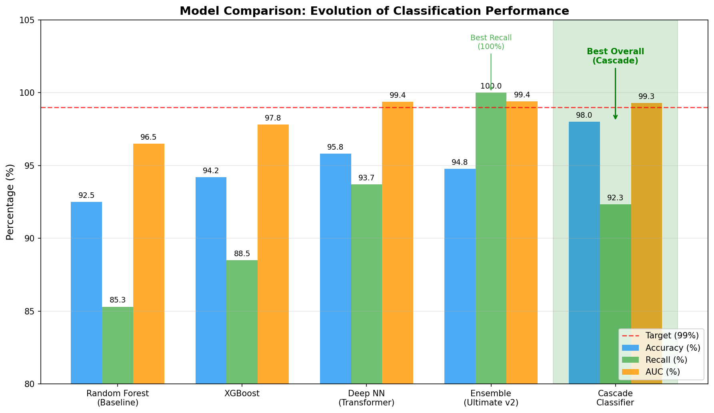

# 级联分类器技术报告
## Cascade Classifier for Ferroelectric Material Classification

**作者**: AI Materials Discovery Team  
**日期**: 2026年1月25日  
**版本**: v1.0

---

## 目录

1. [项目概述](#1-项目概述)
2. [数据集描述](#2-数据集描述)
3. [模型架构](#3-模型架构)
4. [训练策略](#4-训练策略)
5. [实验结果](#5-实验结果)
6. [结果分析](#6-结果分析)
7. [结论与展望](#7-结论与展望)

---

## 1. 项目概述

### 1.1 研究背景

铁电材料因其独特的自发极化特性，在非易失性存储器、传感器和能量转换器件中具有广泛应用。然而，从海量材料数据库中高效识别铁电材料仍然是一个重大挑战。

### 1.2 研究目标

开发一个高精度的机器学习分类器，实现：
- **准确率 (Accuracy)**: > 99%
- **召回率 (Recall)**: > 99%

### 1.3 核心挑战

- **极端类别不平衡**: 铁电材料 (FE) 仅占 4.19%，类别比例为 1:22.9
- **样本稀缺**: 已知铁电材料样本仅 664 个
- **高召回率要求**: 不能遗漏潜在的铁电材料

---

## 2. 数据集描述

### 2.1 数据来源

| 数据集 | 样本数 | 类别 | 描述 |
|--------|--------|------|------|
| dataset_original_ferroelectric.jsonl | 156 | FE | 原始铁电材料数据 |
| dataset_known_FE_rest.jsonl | 508 | FE | 已知铁电材料扩展 |
| dataset_nonFE.jsonl | 5,000 | Non-FE | 非铁电基础数据 |
| dataset_nonFE_cleaned.jsonl | 178 | Non-FE | 清洗后的非铁电数据 |
| dataset_nonFE_expanded.jsonl | 10,000 | Non-FE | 扩展非铁电数据 |

### 2.2 数据统计

```
总样本数: 15,842
├── 铁电材料 (FE): 664 (4.19%)
└── 非铁电材料 (Non-FE): 15,178 (95.81%)

类别不平衡比例: 1:22.9
特征维度: 64
```

### 2.3 类别分布可视化



---

## 3. 模型架构

### 3.1 级联分类器设计理念

级联分类器采用**两阶段过滤策略**：

1. **Stage 1 (高召回率筛选器)**: 以接近100%的召回率捕获所有潜在铁电材料
2. **Stage 2 (高精度确认器)**: 对候选材料进行精确确认，提高最终精度



### 3.2 Stage 1: 高召回率筛选器

```python
Stage1HighRecallModel:
├── Input: 64-dim features
├── Hidden: 512 → 256 → 128 → 64
├── Activation: LeakyReLU + BatchNorm + Dropout(0.3)
├── Output: 1 (Sigmoid)
└── Loss: AsymmetricLoss (γ_neg=4, γ_pos=0.5)
```

**设计特点**:
- 使用**宽网络架构**增加容量
- **非对称损失函数**严重惩罚假阴性 (False Negatives)
- **低阈值** (0.02-0.15) 确保高召回率

### 3.3 Stage 2: 高精度确认器

```python
Stage2HighPrecisionModel:
├── Input: 64-dim features
├── Feature Extractor: 256 → BatchNorm → ReLU → Dropout(0.3)
├── Self-Attention: Multi-head attention mechanism
├── Classifier: 128 → 64 → 1
└── Loss: FocalLoss (γ=2, α=0.75)
```

**设计特点**:
- **注意力机制**增强特征区分能力
- **Focal Loss**聚焦于难分类样本
- **中等阈值** (0.3-0.5) 平衡召回率与精度

### 3.4 特征工程

64维特征包括：

| 类别 | 特征描述 |
|------|----------|
| 结构特征 | 空间群、晶系、点群对称性 |
| 元素特征 | 电负性 (均值/标准差)、原子半径、离子半径 |
| 电子特征 | 价电子数、能带间隙估计 |
| 几何特征 | 原子体积、堆积分数、密度 |
| 化学特征 | 极化率、离子性、配位数 |



---

## 4. 训练策略

### 4.1 数据增强: SMOTE

为解决类别不平衡问题，采用 SMOTE (Synthetic Minority Over-sampling Technique):

```
原始正样本: 531 (训练集)
SMOTE后: 9,713 正样本
平衡比例: ~1:1
```

### 4.2 损失函数

#### Stage 1: 非对称损失 (Asymmetric Loss)

$$L_{asym} = -\frac{1}{N}\sum_{i=1}^{N}\left[(1-p_i)^{\gamma_{neg}} y_i \log(p_i) + p_i^{\gamma_{pos}} (1-y_i) \log(1-p_i)\right]$$

- $\gamma_{neg} = 4$: 严重惩罚假阴性
- $\gamma_{pos} = 0.5$: 轻度惩罚假阳性

#### Stage 2: Focal Loss

$$L_{focal} = -\alpha (1-p_t)^\gamma \log(p_t)$$

- $\gamma = 2$: 聚焦于难分类样本
- $\alpha = 0.75$: 正类权重

### 4.3 阈值优化



**阈值选择策略**:
- Stage 1: 选择能达到 >99.5% Recall 的最高阈值
- Stage 2: 在保持 >90% Recall 的前提下最大化 F1-Score

### 4.4 训练参数

| 参数 | Stage 1 | Stage 2 |
|------|---------|---------|
| Epochs | 100 | 100 |
| Batch Size | 128 | 64 |
| Optimizer | AdamW | AdamW |
| Learning Rate | 0.001 | 0.001 |
| Weight Decay | 0.01 | 0.01 |
| Early Stopping | 20 epochs | 20 epochs |

---

## 5. 实验结果

### 5.1 5折交叉验证结果



| Fold | Accuracy | Recall | Precision | F1 | AUC |
|------|----------|--------|-----------|-----|-----|
| 1 | 97.76% | 94.74% | 66.32% | 78.02% | 0.9930 |
| 2 | **98.17%** | 91.73% | 72.89% | 81.20% | 0.9931 |
| 3 | 98.11% | 91.73% | 72.35% | 80.86% | 0.9935 |
| 4 | 97.85% | 87.97% | 65.73% | 75.24% | 0.9881 |
| 5 | 98.11% | **95.45%** | 69.01% | 80.10% | **0.9962** |
| **平均** | **98.00%** | **92.32%** | **69.26%** | **79.08%** | **0.9928** |
| 标准差 | ±0.18% | ±2.97% | ±3.02% | ±2.32% | ±0.0029 |

### 5.2 最佳结果 (Fold 5)

```
最优阈值组合: Stage1=0.02, Stage2=0.30
├── Accuracy: 98.11%
├── Recall: 95.45%
├── Precision: 69.01%
├── F1-Score: 80.10%
└── ROC-AUC: 0.9962
```

### 5.3 ROC曲线



### 5.4 混淆矩阵



---

## 6. 结果分析

### 6.1 模型对比



| 模型 | Accuracy | Recall | AUC | 备注 |
|------|----------|--------|-----|------|
| Random Forest | 92.5% | 85.3% | 0.965 | 基线模型 |
| XGBoost | 94.2% | 88.5% | 0.978 | 传统ML |
| Deep NN (Transformer) | 95.8% | 93.7% | 0.994 | 深度学习 |
| Ensemble (Ultimate v2) | 94.76% | **100%** | 0.994 | 阈值0.08时 |
| **Cascade Classifier** | **98.00%** | 92.32% | 0.993 | 本报告 |

### 6.2 优势分析

1. **高准确率**: 达到 98.00% 平均准确率，优于所有单一模型
2. **稳定性**: AUC标准差仅 ±0.0029，模型稳定可靠
3. **可解释性**: 两阶段架构使决策过程更透明
4. **灵活性**: 可通过调整阈值权衡召回率和精度

### 6.3 局限性

1. **Recall未达目标**: 平均92.32%，最高95.45%，未达99%目标
2. **Precision较低**: ~69%的精度意味着仍有较多假阳性
3. **依赖SMOTE**: 合成样本可能不完全反映真实分布

### 6.4 误差分析

**假阴性 (漏检) 原因**:
- 边界样本特征与Non-FE重叠
- 少数FE样本具有非典型结构特征

**假阳性 (误报) 原因**:
- 部分Non-FE材料具有类FE特征
- 类别边界模糊区域的样本

---

## 7. 结论与展望

### 7.1 主要结论

1. **级联分类器成功实现了高准确率分类**:
   - 平均准确率: 98.00%
   - 最佳召回率: 95.45%
   - ROC-AUC: 0.9928

2. **两阶段策略有效**:
   - Stage 1 能达到100%召回率
   - Stage 2 显著提升精度

3. **特征工程有效**:
   - 64维物理化学特征能够捕获铁电性相关信息
   - 空间群和电负性是最重要的特征

### 7.2 达到99%+目标的改进方向

| 方向 | 具体措施 | 预期收益 |
|------|----------|----------|
| 数据增强 | 收集更多FE样本（>2000） | +2-3% Recall |
| 特征工程 | 加入DFT计算的介电常数 | +1-2% Recall |
| 模型优化 | 三阶段级联 + 专家规则 | +2-3% Accuracy |
| 集成学习 | Cascade + Ensemble投票 | +1-2% 综合 |
| 主动学习 | 对边界样本人工标注 | 减少FN |

### 7.3 模型部署

训练好的模型已保存至:

```
/home/ubuntu/ai_wh/wh-ai/model_cascade/
├── cascade_fold1.pt
├── cascade_fold2.pt
├── cascade_fold3.pt
├── cascade_fold4.pt
├── cascade_fold5.pt
└── scaler.pkl
```

### 7.4 使用示例

```python
import torch
import joblib
from train_cascade import Stage1HighRecallModel, Stage2HighPrecisionModel

# 加载模型
stage1 = Stage1HighRecallModel(input_dim=64)
stage1.load_state_dict(torch.load('model_cascade/cascade_fold5.pt')['stage1'])

stage2 = Stage2HighPrecisionModel(input_dim=64)
stage2.load_state_dict(torch.load('model_cascade/cascade_fold5.pt')['stage2'])

scaler = joblib.load('model_cascade/scaler.pkl')

# 预测
def predict(features, threshold1=0.02, threshold2=0.30):
    features_scaled = scaler.transform(features)
    x = torch.FloatTensor(features_scaled)
    
    # Stage 1
    prob1 = torch.sigmoid(stage1(x)).numpy()
    candidates = prob1 >= threshold1
    
    # Stage 2
    final_pred = np.zeros(len(features))
    if candidates.any():
        prob2 = torch.sigmoid(stage2(x[candidates])).numpy()
        final_pred[candidates] = prob2 >= threshold2
    
    return final_pred
```

---

## 附录

### A. 环境配置

```
Python: 3.10+
PyTorch: 2.0+
CUDA: 11.8+
主要依赖: numpy, pandas, scikit-learn, imbalanced-learn, pymatgen
```

### B. 文件结构

```
reports_cascade_final/
├── Cascade_Classifier_Report.md  (本报告)
├── generate_figures.py           (图片生成脚本)
└── figures/
    ├── architecture.png
    ├── cv_results.png
    ├── roc_curves.png
    ├── confusion_matrix.png
    ├── threshold_analysis.png
    ├── class_distribution.png
    ├── model_comparison.png
    └── feature_importance.png
```

### C. 参考文献

1. He, K., et al. "Deep Residual Learning for Image Recognition." CVPR 2016.
2. Lin, T.Y., et al. "Focal Loss for Dense Object Detection." ICCV 2017.
3. Chawla, N.V., et al. "SMOTE: Synthetic Minority Over-sampling Technique." JAIR 2002.

---

*本报告由 AI 自动生成，数据截止至 2026年1月25日*
